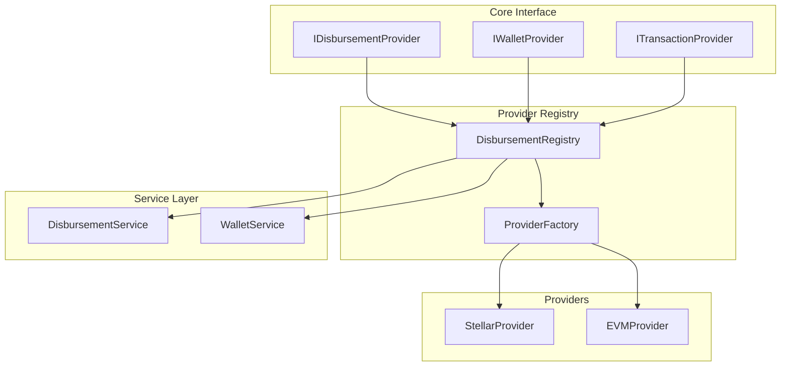

# Pluggable Disbursement System Documentation

## Table of Contents
1. [Overview](#overview)
2. [Architecture](#architecture)
3. [File Structure](#file-structure)
4. [Implementation Details](#implementation-details)
5. [User Stories](#user-stories)
6. [Code Changes](#code-changes)
7. [Migration Guide](#migration-guide)
8. [Testing Strategy](#testing-strategy)

## Overview

The pluggable disbursement system allows for flexible blockchain provider integration while maintaining a consistent interface for fund distribution. This document outlines the implementation details, file changes, and migration strategy.

## Architecture



## File Structure

### New Files to Create

1. **Core Interfaces**
   ```
   src/interfaces/
   ├── disbursement.provider.interface.ts
   ├── wallet.provider.interface.ts
   └── transaction.provider.interface.ts
   ```

2. **Provider Registry**
   ```
   src/registry/
   ├── disbursement.registry.ts
   └── provider.factory.ts
   ```

3. **Providers**
   ```
   src/providers/
   ├── stellar/
   │   ├── stellar.provider.ts
   │   └── stellar.config.ts
   └── evm/
       ├── evm.provider.ts
       └── evm.config.ts
   ```

4. **Configuration**
   ```
   src/config/
   ├── provider.config.ts
   └── chain.config.ts
   ```

### Files to Modify

1. **Existing Services**
   ```
   src/stellar/
   ├── stellar.service.ts
   └── stellar.module.ts
   ```

2. **Database Schema**
   ```
   prisma/
   └── schema.prisma
   ```

## Implementation Details

### 1. Core Interfaces

```typescript
// src/interfaces/disbursement.provider.interface.ts
export interface IDisbursementProvider {
  readonly providerId: string;
  readonly chainType: string;
  
  initialize(config: ProviderConfig): Promise<void>;
  disburse(params: DisburseParams): Promise<DisburseResult>;
  getStatus(txId: string): Promise<DisbursementStatus>;
  estimateFees?(params: DisburseParams): Promise<FeeEstimate>;
  validateAddress?(address: string): Promise<boolean>;
}

// src/interfaces/wallet.provider.interface.ts
export interface IWalletProvider {
  readonly providerId: string;
  
  createWallet(): Promise<WalletKeys>;
  importWallet(privateKey: string): Promise<WalletKeys>;
  getBalance(address: string): Promise<Balance>;
}

// src/interfaces/transaction.provider.interface.ts
export interface ITransactionProvider {
  readonly providerId: string;
  
  sendTransaction(tx: Transaction): Promise<TransactionResult>;
  getTransactionStatus(txId: string): Promise<TransactionStatus>;
  estimateGas?(tx: Transaction): Promise<GasEstimate>;
}
```

## Project-Centric Configuration

### 1. Project Blockchain Settings

```typescript
// src/interfaces/project.config.interface.ts
export interface ProjectBlockchainConfig {
  projectId: string;
  primaryProvider: string;
  fallbackProviders: string[];
  enabledProviders: string[];
  settings: {
    stellar?: {
      network: 'testnet' | 'mainnet';
      assetCode: string;
      issuerAddress: string;
      distributionAddress: string;
    };
    evm?: {
      chainId: number;
      rpcUrl: string;
      tokenContract: string;
      gasLimit: number;
      maxGasPrice: string;
    };
  };
  rules: {
    maxAmountPerTransaction: string;
    requiredConfirmations: number;
    timeoutMs: number;
    autoFallback: boolean;
  };
}

// src/dto/project.dto.ts
export class CreateProjectDto {
  name: string;
  description: string;
  
  // Blockchain configuration
  blockchainConfig: {
    primaryProvider: 'stellar' | 'evm';
    enabledProviders: ('stellar' | 'evm')[];
    fallbackEnabled: boolean;
    stellarConfig?: {
      network: 'testnet' | 'mainnet';
      assetCode: string;
    };
    evmConfig?: {
      chainId: number;
      tokenContract: string;
    };
  };
}
```

### 2. Project-Aware Provider Registry

```typescript
// src/registry/project-aware.registry.ts
@Injectable()
export class ProjectAwareDisbursementRegistry {
  private projectProviders: Map<string, Map<string, IDisbursementProvider>> = new Map();
  
  constructor(
    private readonly configService: ConfigService,
    private readonly providerFactory: ProviderFactory,
    private readonly projectService: ProjectService
  ) {}

  async initializeForProject(projectId: string): Promise<void> {
    const projectConfig = await this.projectService.getBlockchainConfig(projectId);
    const providers = new Map<string, IDisbursementProvider>();

    for (const providerId of projectConfig.enabledProviders) {
      const provider = await this.createAndInitializeProvider(providerId, projectConfig);
      providers.set(providerId, provider);
    }

    this.projectProviders.set(projectId, providers);
  }

  private async createAndInitializeProvider(
    providerId: string, 
    projectConfig: ProjectBlockchainConfig
  ): Promise<IDisbursementProvider> {
    const providerConfig = this.buildProviderConfig(providerId, projectConfig);
    const provider = this.providerFactory.createProvider(providerId, providerConfig);
    await provider.initialize(providerConfig);
    return provider;
  }

  private buildProviderConfig(
    providerId: string, 
    projectConfig: ProjectBlockchainConfig
  ): ProviderConfig {
    switch (providerId) {
      case 'stellar':
        return {
          providerId: 'stellar',
          chainType: 'stellar',
          rpcUrl: this.configService.get('STELLAR_RPC_URL'),
          network: projectConfig.settings.stellar?.network || 'testnet',
          assetCode: projectConfig.settings.stellar?.assetCode,
          issuer: projectConfig.settings.stellar?.issuerAddress,
        };
      case 'evm':
        return {
          providerId: 'evm',
          chainType: 'evm',
          rpcUrl: projectConfig.settings.evm?.rpcUrl || this.configService.get('EVM_RPC_URL'),
          network: 'mainnet',
          contracts: {
            token: projectConfig.settings.evm?.tokenContract,
          },
          options: {
            gasLimit: projectConfig.settings.evm?.gasLimit,
            maxGasPrice: projectConfig.settings.evm?.maxGasPrice,
          },
        };
      default:
        throw new Error(`Unknown provider: ${providerId}`);
    }
  }

  getProvidersForProject(projectId: string): Map<string, IDisbursementProvider> {
    const providers = this.projectProviders.get(projectId);
    if (!providers) {
      throw new Error(`No providers initialized for project: ${projectId}`);
    }
    return providers;
  }

  getPrimaryProvider(projectId: string): IDisbursementProvider {
    const projectConfig = await this.projectService.getBlockchainConfig(projectId);
    const providers = this.getProvidersForProject(projectId);
    
    const primaryProvider = providers.get(projectConfig.primaryProvider);
    if (!primaryProvider) {
      throw new Error(`Primary provider ${projectConfig.primaryProvider} not found for project: ${projectId}`);
    }
    
    return primaryProvider;
  }
}
```

### 3. Project Service with Blockchain Configuration

```typescript
// src/services/project.service.ts
@Injectable()
export class ProjectService {
  constructor(
    private readonly prisma: PrismaService,
    private readonly registry: ProjectAwareDisbursementRegistry
  ) {}

  async createProject(createProjectDto: CreateProjectDto): Promise<Project> {
    const project = await this.prisma.project.create({
      data: {
        name: createProjectDto.name,
        description: createProjectDto.description,
        blockchainConfig: createProjectDto.blockchainConfig,
      },
    });

    // Initialize providers for this project
    await this.registry.initializeForProject(project.id);

    return project;
  }

  async updateBlockchainConfig(
    projectId: string, 
    config: ProjectBlockchainConfig
  ): Promise<void> {
    await this.prisma.project.update({
      where: { id: projectId },
      data: { blockchainConfig: config },
    });

    // Re-initialize providers with new config
    await this.registry.initializeForProject(projectId);
  }

  async getBlockchainConfig(projectId: string): Promise<ProjectBlockchainConfig> {
    const project = await this.prisma.project.findUnique({
      where: { id: projectId },
      select: { blockchainConfig: true },
    });

    if (!project?.blockchainConfig) {
      throw new Error(`No blockchain config found for project: ${projectId}`);
    }

    return project.blockchainConfig as ProjectBlockchainConfig;
  }
}
```

### 4. Project-Aware Disbursement Service

```typescript
// src/services/disbursement.service.ts
@Injectable()
export class DisbursementService {
  constructor(
    private readonly registry: ProjectAwareDisbursementRegistry,
    private readonly projectService: ProjectService,
    private readonly logger: Logger
  ) {}

  async disburse(projectId: string, params: DisburseParams): Promise<DisburseResult> {
    const projectConfig = await this.projectService.getBlockchainConfig(projectId);
    const providers = [
      projectConfig.primaryProvider,
      ...(projectConfig.rules.autoFallback ? projectConfig.fallbackProviders : [])
    ];

    for (const providerId of providers) {
      try {
        const provider = this.registry.getProvidersForProject(projectId).get(providerId);
        if (!provider) {
          this.logger.warn(`Provider ${providerId} not available for project ${projectId}`);
          continue;
        }

        const result = await provider.disburse(params);
        
        // Log successful disbursement
        await this.logDisbursement(projectId, providerId, params, result);
        
        return result;
      } catch (error) {
        this.logger.error(`Provider ${providerId} failed for project ${projectId}:`, error);
        continue;
      }
    }
    
    throw new DisbursementError('ALL_PROVIDERS_FAILED', { projectId, providers });
  }

  private async logDisbursement(
    projectId: string,
    providerId: string,
    params: DisburseParams,
    result: DisburseResult
  ): Promise<void> {
    await this.prisma.disbursement.create({
      data: {
        projectId,
        provider: providerId,
        amount: params.amount,
        recipient: params.recipient,
        txId: result.txId,
        status: 'completed',
        metadata: { params, result },
      },
    });
  }
}
```

### 5. Database Schema Updates

```prisma
// prisma/schema.prisma
model Project {
  id                String   @id @default(uuid())
  name              String
  description       String?
  blockchainConfig  Json     // Store project-specific blockchain configuration
  createdAt         DateTime @default(now())
  updatedAt         DateTime @updatedAt
  
  disbursements     Disbursement[]
  
  @@map("tbl_projects")
}

model Disbursement {
  id            String   @id @default(uuid())
  projectId     String
  provider      String   // Which provider was used
  amount        Decimal
  recipient     String
  token         String?
  txId          String?
  status        String
  fallbackUsed  Boolean  @default(false)
  gasFeePaid    Decimal?
  metadata      Json?
  createdAt     DateTime @default(now())
  updatedAt     DateTime @updatedAt
  
  project       Project  @relation(fields: [projectId], references: [id])
  
  @@map("tbl_disbursements")
}

model ProviderHealth {
  id          String   @id @default(uuid())
  projectId   String
  providerId  String
  isHealthy   Boolean
  lastCheck   DateTime
  errorCount  Int      @default(0)
  metadata    Json?
  
  @@unique([projectId, providerId])
  @@map("tbl_provider_health")
}
```

### 6. API Endpoints for Project Configuration

```typescript
// src/controllers/project.controller.ts
@Controller('projects')
export class ProjectController {
  constructor(
    private readonly projectService: ProjectService,
    private readonly disbursementService: DisbursementService
  ) {}

  @Post()
  async createProject(@Body() createProjectDto: CreateProjectDto): Promise<Project> {
    return this.projectService.createProject(createProjectDto);
  }

  @Put(':id/blockchain-config')
  async updateBlockchainConfig(
    @Param('id') projectId: string,
    @Body() config: ProjectBlockchainConfig
  ): Promise<void> {
    return this.projectService.updateBlockchainConfig(projectId, config);
  }

  @Get(':id/blockchain-config')
  async getBlockchainConfig(@Param('id') projectId: string): Promise<ProjectBlockchainConfig> {
    return this.projectService.getBlockchainConfig(projectId);
  }

  @Post(':id/disbursements')
  async createDisbursement(
    @Param('id') projectId: string,
    @Body() params: DisburseParams
  ): Promise<DisburseResult> {
    return this.disbursementService.disburse(projectId, params);
  }

  @Get(':id/providers/status')
  async getProviderStatus(@Param('id') projectId: string): Promise<ProviderStatus[]> {
    // Return health status of all providers for this project
    const providers = this.registry.getProvidersForProject(projectId);
    const statusList = [];
    
    for (const [providerId, provider] of providers) {
      const status = await this.checkProviderHealth(projectId, providerId, provider);
      statusList.push(status);
    }
    
    return statusList;
  }
}
```

### 7. Project Creation Flow

```typescript
// Example: Creating a project with specific blockchain configuration
const createProjectRequest = {
  name: "Emergency Relief Project",
  description: "Flood relief disbursement project",
  blockchainConfig: {
    primaryProvider: "stellar",
    enabledProviders: ["stellar", "evm"],
    fallbackEnabled: true,
    stellarConfig: {
      network: "testnet",
      assetCode: "RELIEF",
    },
    evmConfig: {
      chainId: 84532, // Base Sepolia
      tokenContract: "0x...",
    }
  }
};

// This will automatically:
// 1. Create the project in database
// 2. Initialize the specified providers
// 3. Configure provider settings based on project config
const project = await projectService.createProject(createProjectRequest);
```

### 8. Default Provider Registration

```typescript
// src/config/default-providers.config.ts
export const DEFAULT_PROVIDER_CONFIGS = {
  stellar: {
    testnet: {
      rpcUrl: 'https://soroban-testnet.stellar.org:443',
      network: 'testnet',
    },
    mainnet: {
      rpcUrl: 'https://soroban-mainnet.stellar.org:443',
      network: 'mainnet',
    },
  },
  evm: {
    'base-sepolia': {
      chainId: 84532,
      rpcUrl: 'https://base-sepolia-rpc.publicnode.com',
      name: 'Base Sepolia',
    },
    'base-mainnet': {
      chainId: 8453,
      rpcUrl: 'https://base-mainnet.public.blastapi.io',
      name: 'Base Mainnet',
    },
  },
};

// src/services/provider-defaults.service.ts
@Injectable()
export class ProviderDefaultsService {
  getAvailableProviders(): string[] {
    return Object.keys(DEFAULT_PROVIDER_CONFIGS);
  }

  getProviderNetworks(providerId: string): string[] {
    return Object.keys(DEFAULT_PROVIDER_CONFIGS[providerId] || {});
  }

  getDefaultConfig(providerId: string, network: string): any {
    return DEFAULT_PROVIDER_CONFIGS[providerId]?.[network];
  }
}
```

This approach ensures that:

1. **No Hardcoded Chains**: Each project defines its own blockchain configuration
2. **Flexible Provider Selection**: Projects can choose which providers to enable
3. **Dynamic Registration**: Providers are initialized based on project configuration
4. **Fallback Configuration**: Each project can define its own fallback strategy
5. **Default Settings**: System provides sensible defaults while allowing customization

The system becomes truly project-centric where blockchain choice is a configuration decision made during project creation, not a system-wide hardcoded setting.

## User Stories

### 1. Project Setup

```typescript
// Example usage in project setup
async function setupProject() {
  const config: ChainConfig = {
    defaultProvider: 'stellar',
    fallbackProviders: ['evm'],
    providers: {
      stellar: {
        providerId: 'stellar',
        chainType: 'stellar',
        rpcUrl: process.env.STELLAR_RPC_URL
      },
      evm: {
        providerId: 'evm',
        chainType: 'evm',
        rpcUrl: process.env.EVM_RPC_URL,
        contracts: {
          token: process.env.TOKEN_CONTRACT
        }
      }
    }
  };

  await disbursementService.initialize(config);
}
```

### 2. Disbursement Execution

```typescript
// Example disbursement execution
async function executeDisbursement() {
  const params: DisburseParams = {
    amount: '100',
    recipient: '0x...',
    token: 'USDC',
    metadata: {
      projectId: 'project-123',
      batchId: 'batch-456'
    }
  };

  const result = await disbursementService.disburse(params);
  console.log(`Disbursement completed: ${result.txId}`);
}
```

## Code Changes

### 1. Database Schema Updates

```prisma
// prisma/schema.prisma
model Disbursement {
  id          String   @id @default(uuid())
  amount      Decimal
  recipient   String
  token       String
  provider    String   // New field for provider identification
  txId        String?
  status      String
  metadata    Json?
  createdAt   DateTime @default(now())
  updatedAt   DateTime @updatedAt
}
```

### 2. Configuration Updates

```typescript
// src/config/chain.config.ts
export interface ChainConfig {
  defaultProvider: string;
  fallbackProviders: string[];
  providers: Record<string, ProviderConfig>;
}

// src/config/provider.config.ts
export interface ProviderConfig {
  providerId: string;
  chainType: string;
  rpcUrl: string;
  network: string;
  contracts?: {
    token?: string;
    disbursement?: string;
  };
  options?: {
    gasLimit?: number;
    confirmations?: number;
    timeout?: number;
  };
}
```

## Migration Guide

### 1. Preparation

1. Backup existing data
2. Create new database migrations
3. Update environment variables

### 2. Implementation Steps

1. Create new interface files
2. Implement provider registry
3. Create EVM provider
4. Update existing Stellar provider
5. Update service layer
6. Add new configurations

## Project Impact Analysis

### 1. Current Functionality Impact

#### Minimal Breaking Changes
- **Stellar Operations**: Existing Stellar disbursement functionality will remain unchanged
- **API Compatibility**: Current API endpoints will continue to work with backward compatibility
- **Database Records**: Existing disbursement records will remain valid with new optional fields

#### Enhanced Capabilities
- **Multi-chain Support**: Projects can now choose between Stellar and EVM for disbursements
- **Fallback Mechanisms**: Automatic failover between providers increases reliability
- **Provider Flexibility**: Easy addition of new blockchain providers in the future

### 2. User Experience Changes

#### For Project Administrators
```typescript
// Before: Fixed to Stellar
await stellarService.disburse(params);

// After: Provider selection with fallback
await disbursementService.disburse({
  ...params,
  preferredProvider: 'stellar',
  fallbackEnabled: true
});
```

#### For End Users (Beneficiaries)
- **Wallet Compatibility**: May receive funds on different blockchain networks
- **Transaction Times**: Different confirmation times based on selected provider
- **Fee Structures**: Varying transaction costs depending on blockchain used

### 3. Database Impact

#### Schema Changes
```sql
-- New columns added to existing tables
ALTER TABLE tbl_disbursement ADD COLUMN provider VARCHAR(50) DEFAULT 'stellar';
ALTER TABLE tbl_disbursement ADD COLUMN fallback_used BOOLEAN DEFAULT false;
ALTER TABLE tbl_disbursement ADD COLUMN gas_fees DECIMAL(18,8);
ALTER TABLE tbl_disbursement ADD COLUMN confirmation_blocks INTEGER;

-- New configuration table
CREATE TABLE tbl_provider_configs (
  id SERIAL PRIMARY KEY,
  project_id UUID,
  provider_id VARCHAR(50),
  config JSONB,
  is_active BOOLEAN DEFAULT true,
  created_at TIMESTAMP DEFAULT NOW()
);
```

#### Data Migration Requirements
```typescript
// Migration script to update existing records
async function migrateExistingDisbursements() {
  await prisma.disbursement.updateMany({
    where: { provider: null },
    data: { provider: 'stellar' }
  });
}
```

### 4. API Changes

#### New Endpoints
```typescript
// Provider management
POST /api/v1/projects/{id}/providers/configure
GET /api/v1/projects/{id}/providers/status
PUT /api/v1/projects/{id}/providers/{providerId}/toggle

// Enhanced disbursement
POST /api/v1/projects/{id}/disbursements/multi-chain
GET /api/v1/projects/{id}/disbursements/provider-stats
```

#### Modified Endpoints
```typescript
// Enhanced disbursement endpoint
POST /api/v1/projects/{id}/disbursements
{
  "amount": "100",
  "recipients": ["address1", "address2"],
  "provider": "stellar",           // New field
  "fallbackEnabled": true,         // New field
  "maxGasPrice": "50000000000"     // New field for EVM
}
```

### 5. Configuration Impact

#### Environment Variables
```bash
# New EVM-related variables
EVM_RPC_URL=https://base-sepolia-rpc.publicnode.com
EVM_CHAIN_ID=84532
EVM_TOKEN_CONTRACT=0x...
EVM_GAS_LIMIT=100000

# Enhanced Stellar configuration
STELLAR_FALLBACK_ENABLED=true
STELLAR_TIMEOUT_MS=30000

# Provider configuration
DEFAULT_PROVIDER=stellar
FALLBACK_PROVIDERS=evm
PROVIDER_HEALTH_CHECK_INTERVAL=60000
```

#### Project Configuration
```typescript
// New project-level settings
interface ProjectConfig {
  disbursement: {
    defaultProvider: 'stellar' | 'evm';
    fallbackEnabled: boolean;
    providers: {
      stellar: StellarConfig;
      evm: EVMConfig;
    };
    rules: {
      maxAmountPerTransaction: string;
      requiredConfirmations: number;
      timeoutMs: number;
    };
  };
}
```

### 6. Performance Implications

#### Positive Impacts
- **Load Distribution**: Traffic can be distributed across multiple providers
- **Reduced Downtime**: Fallback mechanisms improve system availability
- **Parallel Processing**: Multiple providers can handle disbursements simultaneously

#### Potential Concerns
- **Initialization Overhead**: Loading multiple providers increases startup time
- **Memory Usage**: Multiple provider instances require additional memory
- **Monitoring Complexity**: Need to monitor multiple blockchain networks

### 7. Security Considerations

#### Enhanced Security
- **Provider Isolation**: Failures in one provider don't affect others
- **Multi-chain Diversification**: Reduces single point of failure risk
- **Configurable Security Levels**: Different security settings per provider

#### New Security Requirements
```typescript
// Enhanced security configuration
interface SecurityConfig {
  providers: {
    stellar: {
      maxDailyAmount: string;
      requiredSignatures: number;
      ipWhitelist: string[];
    };
    evm: {
      maxGasPrice: string;
      contractWhitelist: string[];
      multisigRequired: boolean;
    };
  };
}
```

### 8. Monitoring and Alerting Changes

#### New Metrics to Track
```typescript
interface ProviderMetrics {
  provider: string;
  successRate: number;
  averageConfirmationTime: number;
  totalVolume: string;
  failureReasons: Record<string, number>;
  gasUsage?: {
    average: string;
    total: string;
  };
}
```

#### Enhanced Alerting
```typescript
// New alert conditions
const alertRules = {
  providerFailure: {
    condition: 'success_rate < 0.95',
    severity: 'critical'
  },
  fallbackActivated: {
    condition: 'fallback_used > 0.1',
    severity: 'warning'
  },
  highGasFees: {
    condition: 'avg_gas_price > threshold',
    severity: 'info'
  }
};
```

### 9. Development Workflow Impact

#### Testing Requirements
```typescript
// Enhanced testing matrix
const testMatrix = [
  { provider: 'stellar', scenario: 'normal_operation' },
  { provider: 'evm', scenario: 'normal_operation' },
  { provider: 'stellar', scenario: 'provider_failure' },
  { provider: 'evm', scenario: 'provider_failure' },
  { providers: ['stellar', 'evm'], scenario: 'fallback_mechanism' }
];
```

#### CI/CD Changes
```yaml
# Enhanced CI pipeline
test:
  matrix:
    provider: [stellar, evm]
    network: [testnet, mainnet]
  script:
    - npm run test:unit
    - npm run test:integration:$provider
    - npm run test:e2e:$provider:$network
```

### 10. Cost Implications

#### Operational Costs
- **Infrastructure**: Additional RPC endpoints and monitoring
- **Transaction Fees**: Different fee structures across providers
- **Development**: Initial implementation and ongoing maintenance

#### Cost Optimization
```typescript
// Dynamic provider selection based on cost
async function selectCostOptimalProvider(amount: string): Promise<string> {
  const stellarFee = await stellar.estimateFee(amount);
  const evmFee = await evm.estimateFee(amount);
  
  return stellarFee.total < evmFee.total ? 'stellar' : 'evm';
}
```

### 11. Migration Timeline

#### Phase 1: Foundation (Week 1-2)
- Create interfaces and registry
- Update database schema
- Basic provider implementations

#### Phase 2: Integration (Week 3-4)
- Update existing services
- Implement fallback mechanisms
- Add configuration management

#### Phase 3: Testing (Week 5-6)
- Comprehensive testing
- Performance optimization
- Security validation

#### Phase 4: Deployment (Week 7-8)
- Staged rollout
- Monitoring setup
- Documentation updates

### 12. Risk Mitigation

#### Technical Risks
```typescript
// Circuit breaker pattern for provider failures
class ProviderCircuitBreaker {
  private failureCount = 0;
  private lastFailureTime = 0;
  
  async execute(provider: IDisbursementProvider, params: DisburseParams) {
    if (this.isCircuitOpen()) {
      throw new Error('Circuit breaker is open');
    }
    
    try {
      const result = await provider.disburse(params);
      this.onSuccess();
      return result;
    } catch (error) {
      this.onFailure();
      throw error;
    }
  }
}
```

#### Business Risks
- **User Confusion**: Clear communication about multi-chain options
- **Support Complexity**: Training required for different blockchain systems
- **Regulatory Compliance**: Different compliance requirements per blockchain

This comprehensive impact analysis shows that while the changes are significant, they're designed to be backward-compatible and provide substantial benefits in terms of reliability, flexibility, and future-proofing the system.

## Files Impacted

### 1. New Files to Create

#### Core Interfaces
```
src/interfaces/
├── disbursement.provider.interface.ts          // Core disbursement provider interface
├── wallet.provider.interface.ts                // Wallet provider interface
├── transaction.provider.interface.ts           // Transaction provider interface
├── project.config.interface.ts                 // Project blockchain configuration interface
└── provider.types.ts                          // Common types and enums
```

#### Provider Registry
```
src/registry/
├── project-aware.registry.ts                   // Project-specific provider registry
├── provider.factory.ts                         // Provider factory for instantiation
└── registry.module.ts                         // Registry module configuration
```

#### Blockchain Providers
```
src/providers/
├── stellar/
│   ├── stellar.provider.ts                     // Stellar provider implementation
│   ├── stellar.config.ts                       // Stellar-specific configuration
│   ├── stellar.types.ts                        // Stellar types and interfaces
│   └── stellar.utils.ts                        // Stellar utility functions
├── evm/
│   ├── evm.provider.ts                         // EVM provider implementation
│   ├── evm.config.ts                          // EVM-specific configuration
│   ├── evm.types.ts                           // EVM types and interfaces
│   └── evm.utils.ts                           // EVM utility functions
└── provider.module.ts                         // Providers module configuration
```

#### Configuration Management
```
src/config/
├── provider.config.ts                         // Provider configuration interfaces
├── chain.config.ts                            // Chain configuration interfaces
├── default-providers.config.ts                // Default provider configurations
└── blockchain.config.ts                       // Blockchain-specific configurations
```

#### Enhanced Services
```
src/services/
├── project-blockchain.service.ts              // Project blockchain configuration service
├── provider-defaults.service.ts               // Default provider management
├── provider-health.service.ts                 // Provider health monitoring
└── disbursement-orchestrator.service.ts       // Orchestrates multi-provider disbursements
```

#### DTOs and Validation
```
src/dto/
├── project-blockchain.dto.ts                  // Project blockchain configuration DTOs
├── provider-config.dto.ts                     // Provider configuration DTOs
├── disbursement-request.dto.ts                // Enhanced disbursement request DTOs
└── provider-status.dto.ts                     // Provider status DTOs
```

#### Monitoring and Health
```
src/monitoring/
├── provider-health.monitor.ts                 // Provider health monitoring
├── disbursement.monitor.ts                    // Enhanced disbursement monitoring
├── gas-price.monitor.ts                       // Gas price monitoring for EVM
└── network-status.monitor.ts                  // Network status monitoring
```

#### Testing Files
```
test/
├── unit/
│   ├── providers/
│   │   ├── stellar.provider.spec.ts           // Stellar provider unit tests
│   │   └── evm.provider.spec.ts               // EVM provider unit tests
│   ├── registry/
│   │   └── project-aware.registry.spec.ts     // Registry unit tests
│   └── services/
│       └── disbursement.service.spec.ts       // Enhanced service tests
├── integration/
│   ├── multi-provider.integration.spec.ts     // Multi-provider integration tests
│   ├── fallback.integration.spec.ts           // Fallback mechanism tests
│   └── project-config.integration.spec.ts     // Project configuration tests
└── e2e/
    ├── project-creation.e2e.spec.ts           // Project creation E2E tests
    ├── multi-chain-disbursement.e2e.spec.ts   // Multi-chain disbursement E2E tests
    └── provider-failover.e2e.spec.ts          // Provider failover E2E tests
```

### 2. Files to Modify

#### Existing Core Services
```
src/stellar/
├── stellar.service.ts                         // Update to implement new interfaces
├── stellar.module.ts                          // Update to register with new system
├── stellar.controller.ts                      // Update for project-aware endpoints
└── dto/disburse.dto.ts                        // Update DTOs for compatibility
```

#### Project Management
```
src/projects/                                  // If exists, or create new
├── project.service.ts                         // Add blockchain configuration methods
├── project.controller.ts                      // Add blockchain configuration endpoints
├── project.module.ts                          // Update to include new dependencies
└── project.entity.ts                          // Update to include blockchain config
```

#### Main Application Files
```
src/
├── app.module.ts                              // Register new modules and providers
├── main.ts                                    // Update for provider initialization
└── types.ts                                   // Add new types and interfaces
```

#### Database Schema
```
prisma/
├── schema.prisma                              // Add new models and update existing ones
└── migrations/                                // New migration files
    ├── 001_add_project_blockchain_config.sql  // Add blockchain config to projects
    ├── 002_add_provider_fields.sql            // Add provider fields to disbursements
    ├── 003_add_provider_health_table.sql      // Add provider health monitoring
    └── 004_add_fallback_tracking.sql          // Add fallback tracking fields
```

#### Configuration Files
```
.env                                           // Add new environment variables
.env.example                                   // Update example with new variables
config/
├── database.config.ts                        // Update for new models
└── app.config.ts                             // Add provider configurations
```

#### API Documentation
```
docs/
├── api/
│   ├── project-blockchain.yaml               // OpenAPI spec for blockchain endpoints
│   └── disbursement-v2.yaml                  // Updated disbursement API spec
└── swagger/
    └── disbursement.swagger.ts               // Update Swagger documentation
```

### 3. Files to Update for Integration

#### Controllers
```
src/controllers/
├── project.controller.ts                     // Add blockchain configuration endpoints
├── disbursement.controller.ts                // Update for multi-provider support
└── admin.controller.ts                       // Add provider management endpoints
```

#### Middleware and Guards
```
src/middleware/
├── project-provider.middleware.ts            // Middleware to validate provider config
└── provider-health.middleware.ts             // Middleware to check provider health

src/guards/
├── project-access.guard.ts                   // Update for blockchain permissions
└── provider-permission.guard.ts              // New guard for provider operations
```

#### Utilities
```
src/utils/
├── blockchain.utils.ts                       // Blockchain-related utility functions
├── provider.utils.ts                         // Provider utility functions
├── address-validation.utils.ts               // Address validation across chains
└── fee-estimation.utils.ts                   // Fee estimation utilities
```

#### Error Handling
```
src/exceptions/
├── provider.exceptions.ts                    // Provider-specific exceptions
├── blockchain.exceptions.ts                  // Blockchain-specific exceptions
└── disbursement.exceptions.ts                // Updated disbursement exceptions
```

### 4. Infrastructure and DevOps Files

#### Docker and Deployment
```
docker/
├── Dockerfile                                // Update with new dependencies
├── docker-compose.yml                        // Add new services if needed
└── docker-compose.dev.yml                    // Development environment updates

deployment/
├── kubernetes/
│   ├── provider-config.yaml                  // Provider configuration as ConfigMap
│   └── disbursement-service.yaml             // Updated service configuration
└── terraform/
    └── provider-infrastructure.tf            // Infrastructure for multiple providers
```

#### CI/CD Pipeline
```
.github/workflows/
├── test-multi-provider.yml                   // Multi-provider testing workflow
├── deploy-staging.yml                        // Update for new dependencies
└── provider-health-check.yml                 // Provider health check workflow

scripts/
├── setup-providers.sh                        // Script to setup providers
├── migrate-existing-projects.sh              // Migration script for existing projects
└── health-check-providers.sh                 // Provider health check script
```

#### Monitoring and Logging
```
monitoring/
├── prometheus/
│   └── provider-metrics.yml                  // Provider-specific metrics
├── grafana/
│   └── provider-dashboard.json               // Provider monitoring dashboard
└── alerts/
    └── provider-alerts.yml                   // Provider failure alerts
```

### 5. Documentation Files

#### Technical Documentation
```
docs/
├── pluggable-disbursement.md                 // This comprehensive guide
├── provider-integration.md                   // Guide for adding new providers
├── migration-guide.md                        // Step-by-step migration guide
├── troubleshooting.md                        // Troubleshooting guide
└── api/
    ├── project-blockchain-api.md             // Project blockchain API docs
    └── provider-management-api.md            // Provider management API docs
```

#### Developer Documentation
```
docs/dev/
├── development-setup.md                      // Setup for multi-provider development
├── testing-strategy.md                       // Testing approach documentation
├── architecture-decisions.md                 // Architecture decision records
└── code-standards.md                         // Coding standards for providers
```

### 6. Package and Dependency Files

#### Package Management
```
package.json                                   // Add new dependencies
package-lock.json                             // Updated lock file
yarn.lock                                     // If using Yarn

libs/                                         // If using workspace approach
├── providers/
│   ├── package.json                          // Provider library package
│   └── tsconfig.json                         // Provider-specific TypeScript config
└── shared/
    ├── package.json                          // Shared utilities package
    └── tsconfig.json                         // Shared TypeScript config
```

#### TypeScript Configuration
```
tsconfig.json                                 // Update paths for new modules
tsconfig.build.json                          // Build configuration updates
.eslintrc.js                                  // Linting rules for new code
.prettierrc                                   // Code formatting rules
```

### 7. Summary of File Impact

#### Total New Files: ~45-50 files
- Core interfaces and types: 8 files
- Provider implementations: 12 files
- Services and utilities: 15 files
- Testing files: 12 files
- Documentation: 8 files

#### Modified Existing Files: ~20-25 files
- Database schema and migrations: 5 files
- Existing services: 8 files
- Configuration files: 6 files
- Infrastructure files: 6 files

#### Total Files Impacted: ~70-75 files

This comprehensive file impact analysis shows the scope of changes required for implementing the pluggable disbursement system while maintaining backward compatibility and following best practices for modular architecture.
