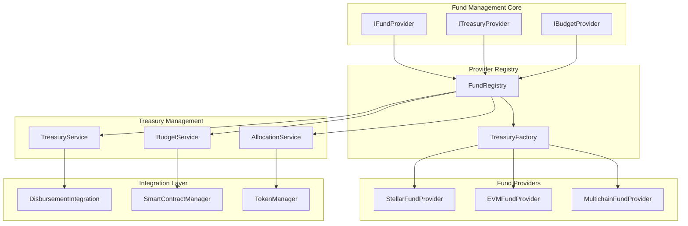

# Pluggable Fund Management System Documentation

## Table of Contents
1. [Overview](#overview)
2. [Architecture](#architecture)
3. [Project-Centric Fund Configuration](#project-centric-fund-configuration)
4. [Implementation Details](#implementation-details)
5. [Smart Contract Integration](#smart-contract-integration)
6. [Treasury Management](#treasury-management)
7. [Budget Allocation](#budget-allocation)
8. [Multi-Token Support](#multi-token-support)
9. [Integration with Disbursement System](#integration-with-disbursement-system)
10. [Files Impacted](#files-impacted)
11. [User Stories and Flows](#user-stories-and-flows)
12. [Security and Access Control](#security-and-access-control)

## Overview

The pluggable fund management system provides flexible treasury operations, budget allocation, and fund tracking across multiple blockchain networks. It integrates seamlessly with the pluggable disbursement system to create a comprehensive financial management platform.

## Architecture



## Project-Centric Fund Configuration

### 1. Project Fund Settings

```typescript
// src/interfaces/project-fund.config.interface.ts
export interface ProjectFundConfig {
  projectId: string;
  treasurySettings: {
    primaryProvider: 'stellar' | 'evm' | 'multichain';
    enabledProviders: string[];
    defaultCurrency: string;
    multiSigRequired: boolean;
    approvalThreshold: string;
  };
  budgetConfig: {
    totalBudget: string;
    allocatedBudget: string;
    reservedBudget: string;
    distributionRules: {
      maxDisbursementPerTransaction: string;
      dailyDisbursementLimit: string;
      monthlyDisbursementLimit: string;
    };
  };
  tokenConfig: {
    stellar?: {
      assetCode: string;
      issuerAddress: string;
      distributionAddress: string;
      trustlineRequired: boolean;
    };
    evm?: {
      tokenContract: string;
      decimals: number;
      symbol: string;
      treasuryContract: string;
    };
  };
  compliance: {
    kycRequired: boolean;
    jurisdictions: string[];
    reportingEnabled: boolean;
    auditTrailEnabled: boolean;
  };
}

// src/dto/project-fund.dto.ts
export class CreateProjectFundDto {
  projectId: string;
  fundingSource: 'donor' | 'treasury' | 'external';
  initialAmount: string;
  currency: string;
  
  treasuryConfig: {
    provider: 'stellar' | 'evm';
    multiSigWallet?: string;
    approvers?: string[];
    thresholdAmount?: string;
  };
  
  budgetRules: {
    autoApprovalLimit: string;
    manualApprovalRequired: boolean;
    emergencyFundPercentage: number;
  };
}
```

### 2. Treasury Provider Interface

```typescript
// src/interfaces/fund.provider.interface.ts
export interface IFundProvider {
  readonly providerId: string;
  readonly chainType: string;
  
  initialize(config: FundProviderConfig): Promise<void>;
  createTreasury(params: CreateTreasuryParams): Promise<TreasuryResult>;
  fundProject(params: FundProjectParams): Promise<FundingResult>;
  transferFunds(params: TransferParams): Promise<TransferResult>;
  getBudgetStatus(projectId: string): Promise<BudgetStatus>;
  freezeFunds(params: FreezeParams): Promise<FreezeResult>;
  releaseFunds(params: ReleaseParams): Promise<ReleaseResult>;
}

// src/interfaces/treasury.provider.interface.ts
export interface ITreasuryProvider {
  readonly providerId: string;
  
  createMultiSigWallet(params: MultiSigParams): Promise<WalletResult>;
  addApprover(walletAddress: string, approver: string): Promise<void>;
  removeApprover(walletAddress: string, approver: string): Promise<void>;
  requireApprovals(walletAddress: string, threshold: number): Promise<void>;
  executeTransaction(params: ExecuteParams): Promise<ExecutionResult>;
}

// src/interfaces/budget.provider.interface.ts
export interface IBudgetProvider {
  readonly providerId: string;
  
  allocateBudget(params: AllocationParams): Promise<AllocationResult>;
  adjustBudget(params: AdjustmentParams): Promise<AdjustmentResult>;
  trackExpenditure(params: ExpenditureParams): Promise<void>;
  generateReport(params: ReportParams): Promise<BudgetReport>;
  validateSpending(params: SpendingParams): Promise<ValidationResult>;
}
```

## Implementation Details

### 1. Project-Aware Fund Registry

```typescript
// src/registry/project-fund.registry.ts
@Injectable()
export class ProjectFundRegistry {
  private projectFundProviders: Map<string, Map<string, IFundProvider>> = new Map();
  private projectTreasuryProviders: Map<string, Map<string, ITreasuryProvider>> = new Map();
  
  constructor(
    private readonly configService: ConfigService,
    private readonly fundFactory: FundProviderFactory,
    private readonly projectService: ProjectService
  ) {}

  async initializeForProject(projectId: string): Promise<void> {
    const projectConfig = await this.projectService.getFundConfig(projectId);
    const fundProviders = new Map<string, IFundProvider>();
    const treasuryProviders = new Map<string, ITreasuryProvider>();

    // Initialize fund providers
    for (const providerId of projectConfig.treasurySettings.enabledProviders) {
      const fundProvider = await this.createFundProvider(providerId, projectConfig);
      const treasuryProvider = await this.createTreasuryProvider(providerId, projectConfig);
      
      fundProviders.set(providerId, fundProvider);
      treasuryProviders.set(providerId, treasuryProvider);
    }

    this.projectFundProviders.set(projectId, fundProviders);
    this.projectTreasuryProviders.set(projectId, treasuryProviders);
  }

  private async createFundProvider(
    providerId: string,
    projectConfig: ProjectFundConfig
  ): Promise<IFundProvider> {
    const providerConfig = this.buildFundProviderConfig(providerId, projectConfig);
    const provider = this.fundFactory.createFundProvider(providerId, providerConfig);
    await provider.initialize(providerConfig);
    return provider;
  }

  private buildFundProviderConfig(
    providerId: string,
    projectConfig: ProjectFundConfig
  ): FundProviderConfig {
    switch (providerId) {
      case 'stellar':
        return {
          providerId: 'stellar',
          chainType: 'stellar',
          rpcUrl: this.configService.get('STELLAR_RPC_URL'),
          networkPassphrase: this.configService.get('STELLAR_NETWORK_PASSPHRASE'),
          assetConfig: projectConfig.tokenConfig.stellar,
          compliance: projectConfig.compliance,
        };
      case 'evm':
        return {
          providerId: 'evm',
          chainType: 'evm',
          rpcUrl: this.configService.get('EVM_RPC_URL'),
          chainId: this.configService.get('EVM_CHAIN_ID'),
          contracts: {
            treasury: projectConfig.tokenConfig.evm?.treasuryContract,
            token: projectConfig.tokenConfig.evm?.tokenContract,
          },
          multiSig: projectConfig.treasurySettings.multiSigRequired,
        };
      default:
        throw new Error(`Unknown fund provider: ${providerId}`);
    }
  }

  getFundProvider(projectId: string, providerId?: string): IFundProvider {
    const providers = this.projectFundProviders.get(projectId);
    if (!providers) {
      throw new Error(`No fund providers for project: ${projectId}`);
    }

    if (providerId) {
      const provider = providers.get(providerId);
      if (!provider) {
        throw new Error(`Fund provider ${providerId} not found for project: ${projectId}`);
      }
      return provider;
    }

    // Return primary provider
    const projectConfig = await this.projectService.getFundConfig(projectId);
    return providers.get(projectConfig.treasurySettings.primaryProvider);
  }
}
```

### 2. EVM Fund Provider Implementation

```typescript
// src/providers/evm/evm-fund.provider.ts
@Injectable()
export class EVMFundProvider implements IFundProvider {
  readonly providerId = 'evm';
  readonly chainType = 'EVM';
  
  private provider: ethers.Provider;
  private treasuryContract: ethers.Contract;
  private tokenContract: ethers.Contract;
  private signer: ethers.Wallet;
  
  constructor(
    private readonly configService: ConfigService,
    private readonly logger: Logger
  ) {}

  async initialize(config: FundProviderConfig): Promise<void> {
    this.provider = new ethers.JsonRpcProvider(config.rpcUrl);
    this.signer = new ethers.Wallet(
      this.configService.get('TREASURY_PRIVATE_KEY'),
      this.provider
    );
    
    this.treasuryContract = new ethers.Contract(
      config.contracts.treasury,
      treasuryABI,
      this.signer
    );
    
    this.tokenContract = new ethers.Contract(
      config.contracts.token,
      tokenABI,
      this.signer
    );
  }

  async createTreasury(params: CreateTreasuryParams): Promise<TreasuryResult> {
    try {
      const tx = await this.treasuryContract.createProjectTreasury(
        params.projectId,
        params.initialAmount,
        params.approvers,
        params.threshold
      );
      
      const receipt = await tx.wait();
      const treasuryAddress = receipt.logs[0].args.treasuryAddress;
      
      return {
        success: true,
        treasuryAddress,
        txHash: tx.hash,
        provider: this.providerId
      };
    } catch (error) {
      this.logger.error(`EVM treasury creation failed: ${error.message}`);
      throw new FundManagementError('TREASURY_CREATION_FAILED', error);
    }
  }

  async fundProject(params: FundProjectParams): Promise<FundingResult> {
    try {
      // First approve the treasury to spend tokens
      const approveTx = await this.tokenContract.approve(
        params.treasuryAddress,
        params.amount
      );
      await approveTx.wait();

      // Then fund the project
      const fundTx = await this.treasuryContract.fundProject(
        params.projectId,
        params.amount,
        params.metadata || {}
      );
      await fundTx.wait();

      return {
        success: true,
        amount: params.amount,
        txHash: fundTx.hash,
        provider: this.providerId
      };
    } catch (error) {
      this.logger.error(`EVM project funding failed: ${error.message}`);
      throw new FundManagementError('PROJECT_FUNDING_FAILED', error);
    }
  }

  async transferFunds(params: TransferParams): Promise<TransferResult> {
    try {
      const tx = await this.treasuryContract.transferFunds(
        params.from,
        params.to,
        params.amount,
        params.reason || ''
      );
      await tx.wait();

      return {
        success: true,
        amount: params.amount,
        from: params.from,
        to: params.to,
        txHash: tx.hash,
        provider: this.providerId
      };
    } catch (error) {
      this.logger.error(`EVM fund transfer failed: ${error.message}`);
      throw new FundManagementError('FUND_TRANSFER_FAILED', error);
    }
  }

  async getBudgetStatus(projectId: string): Promise<BudgetStatus> {
    try {
      const budgetData = await this.treasuryContract.getProjectBudget(projectId);
      
      return {
        projectId,
        totalBudget: budgetData.totalBudget.toString(),
        allocatedBudget: budgetData.allocatedBudget.toString(),
        spentBudget: budgetData.spentBudget.toString(),
        remainingBudget: budgetData.remainingBudget.toString(),
        frozenAmount: budgetData.frozenAmount.toString(),
        provider: this.providerId
      };
    } catch (error) {
      this.logger.error(`Failed to get budget status: ${error.message}`);
      throw new FundManagementError('BUDGET_STATUS_FAILED', error);
    }
  }
}
```

### 3. Stellar Fund Provider Implementation

```typescript
// src/providers/stellar/stellar-fund.provider.ts
@Injectable()
export class StellarFundProvider implements IFundProvider {
  readonly providerId = 'stellar';
  readonly chainType = 'STELLAR';
  
  private server: Server;
  private issuerKeypair: Keypair;
  private distributionKeypair: Keypair;
  private asset: Asset;
  
  constructor(
    private readonly configService: ConfigService,
    private readonly logger: Logger
  ) {}

  async initialize(config: FundProviderConfig): Promise<void> {
    this.server = new Server(config.rpcUrl);
    this.issuerKeypair = Keypair.fromSecret(
      this.configService.get('STELLAR_ISSUER_SECRET')
    );
    this.distributionKeypair = Keypair.fromSecret(
      this.configService.get('STELLAR_DISTRIBUTION_SECRET')
    );
    
    this.asset = new Asset(
      config.assetConfig.assetCode,
      this.issuerKeypair.publicKey()
    );
  }

  async createTreasury(params: CreateTreasuryParams): Promise<TreasuryResult> {
    try {
      const treasuryKeypair = Keypair.random();
      const account = await this.server.loadAccount(this.distributionKeypair.publicKey());
      
      const transaction = new TransactionBuilder(account, {
        fee: BASE_FEE,
        networkPassphrase: Networks.TESTNET
      })
        .addOperation(Operation.createAccount({
          destination: treasuryKeypair.publicKey(),
          startingBalance: '1'
        }))
        .addOperation(Operation.changeTrust({
          source: treasuryKeypair.publicKey(),
          asset: this.asset
        }))
        .setTimeout(180)
        .build();

      transaction.sign(this.distributionKeypair, treasuryKeypair);
      const result = await this.server.submitTransaction(transaction);

      return {
        success: true,
        treasuryAddress: treasuryKeypair.publicKey(),
        txHash: result.hash,
        provider: this.providerId
      };
    } catch (error) {
      this.logger.error(`Stellar treasury creation failed: ${error.message}`);
      throw new FundManagementError('STELLAR_TREASURY_CREATION_FAILED', error);
    }
  }

  async fundProject(params: FundProjectParams): Promise<FundingResult> {
    try {
      const sourceAccount = await this.server.loadAccount(this.issuerKeypair.publicKey());
      
      const transaction = new TransactionBuilder(sourceAccount, {
        fee: BASE_FEE,
        networkPassphrase: Networks.TESTNET
      })
        .addOperation(Operation.payment({
          destination: params.treasuryAddress,
          asset: this.asset,
          amount: params.amount
        }))
        .setTimeout(180)
        .build();

      transaction.sign(this.issuerKeypair);
      const result = await this.server.submitTransaction(transaction);

      return {
        success: true,
        amount: params.amount,
        txHash: result.hash,
        provider: this.providerId
      };
    } catch (error) {
      this.logger.error(`Stellar project funding failed: ${error.message}`);
      throw new FundManagementError('STELLAR_PROJECT_FUNDING_FAILED', error);
    }
  }
}
```

## Treasury Management

### 1. Project Treasury Service

```typescript
// src/services/project-treasury.service.ts
@Injectable()
export class ProjectTreasuryService {
  constructor(
    private readonly fundRegistry: ProjectFundRegistry,
    private readonly projectService: ProjectService,
    private readonly logger: Logger
  ) {}

  async initializeTreasury(projectId: string, params: InitializeTreasuryParams): Promise<TreasuryResult> {
    const fundConfig = await this.projectService.getFundConfig(projectId);
    const provider = this.fundRegistry.getFundProvider(
      projectId, 
      fundConfig.treasurySettings.primaryProvider
    );

    const treasuryResult = await provider.createTreasury({
      projectId,
      initialAmount: params.initialAmount,
      approvers: params.approvers,
      threshold: fundConfig.treasurySettings.approvalThreshold
    });

    // Store treasury information in database
    await this.storeTreasuryInfo(projectId, treasuryResult);

    return treasuryResult;
  }

  async fundProject(projectId: string, params: FundProjectParams): Promise<FundingResult> {
    const fundConfig = await this.projectService.getFundConfig(projectId);
    
    // Check budget constraints
    await this.validateBudgetConstraints(projectId, params.amount);
    
    const provider = this.fundRegistry.getFundProvider(projectId);
    const result = await provider.fundProject(params);

    // Update budget tracking
    await this.updateBudgetTracking(projectId, params.amount, 'funding');

    return result;
  }

  async transferFunds(
    projectId: string, 
    params: TransferFundsParams
  ): Promise<TransferResult> {
    const fundConfig = await this.projectService.getFundConfig(projectId);
    
    // Check if multi-sig approval is required
    if (fundConfig.treasurySettings.multiSigRequired) {
      return this.processMultiSigTransfer(projectId, params);
    }

    const provider = this.fundRegistry.getFundProvider(projectId);
    const result = await provider.transferFunds(params);

    // Log transaction
    await this.logFundTransfer(projectId, params, result);

    return result;
  }

  private async processMultiSigTransfer(
    projectId: string,
    params: TransferFundsParams
  ): Promise<TransferResult> {
    // Create pending transaction
    const pendingTx = await this.createPendingTransaction(projectId, params);
    
    // If enough approvals, execute
    if (pendingTx.approvals >= pendingTx.required) {
      return this.executeMultiSigTransaction(projectId, pendingTx);
    }

    return {
      success: false,
      pending: true,
      transactionId: pendingTx.id,
      requiredApprovals: pendingTx.required,
      currentApprovals: pendingTx.approvals
    };
  }
}
```

## Budget Allocation

### 1. Project Budget Service

```typescript
// src/services/project-budget.service.ts
@Injectable()
export class ProjectBudgetService {
  constructor(
    private readonly fundRegistry: ProjectFundRegistry,
    private readonly projectService: ProjectService,
    private readonly prisma: PrismaService
  ) {}

  async allocateBudget(projectId: string, params: AllocateBudgetParams): Promise<AllocationResult> {
    const fundConfig = await this.projectService.getFundConfig(projectId);
    const provider = this.fundRegistry.getFundProvider(projectId);

    // Validate allocation doesn't exceed total budget
    await this.validateAllocation(projectId, params.amount);

    // Create budget allocation
    const allocation = await this.prisma.budgetAllocation.create({
      data: {
        projectId,
        category: params.category,
        amount: params.amount,
        description: params.description,
        allocatedBy: params.allocatedBy,
        status: 'active'
      }
    });

    // Update project budget tracking
    await this.updateProjectBudget(projectId, params.amount, 'allocation');

    return {
      success: true,
      allocationId: allocation.id,
      amount: params.amount,
      category: params.category
    };
  }

  async getDisbursementBudget(projectId: string): Promise<DisbursementBudget> {
    const budgetStatus = await this.getBudgetStatus(projectId);
    const pendingDisbursements = await this.getPendingDisbursements(projectId);
    
    const availableForDisbursement = BigNumber.from(budgetStatus.remainingBudget)
      .sub(BigNumber.from(pendingDisbursements.totalAmount));

    return {
      totalBudget: budgetStatus.totalBudget,
      allocatedBudget: budgetStatus.allocatedBudget,
      spentBudget: budgetStatus.spentBudget,
      pendingDisbursements: pendingDisbursements.totalAmount,
      availableForDisbursement: availableForDisbursement.toString(),
      dailyLimit: budgetStatus.dailyLimit,
      monthlyLimit: budgetStatus.monthlyLimit
    };
  }

  async validateDisbursementRequest(
    projectId: string,
    amount: string
  ): Promise<ValidationResult> {
    const disbursementBudget = await this.getDisbursementBudget(projectId);
    const fundConfig = await this.projectService.getFundConfig(projectId);

    const validations = [];

    // Check if amount exceeds available budget
    if (BigNumber.from(amount).gt(BigNumber.from(disbursementBudget.availableForDisbursement))) {
      validations.push({
        type: 'INSUFFICIENT_BUDGET',
        message: 'Disbursement amount exceeds available budget',
        severity: 'error'
      });
    }

    // Check daily limit
    const todaysDisbursements = await this.getTodaysDisbursements(projectId);
    const proposedDaily = BigNumber.from(todaysDisbursements).add(BigNumber.from(amount));
    
    if (proposedDaily.gt(BigNumber.from(fundConfig.budgetConfig.distributionRules.dailyDisbursementLimit))) {
      validations.push({
        type: 'DAILY_LIMIT_EXCEEDED',
        message: 'Daily disbursement limit would be exceeded',
        severity: 'warning'
      });
    }

    return {
      valid: validations.filter(v => v.severity === 'error').length === 0,
      warnings: validations.filter(v => v.severity === 'warning'),
      errors: validations.filter(v => v.severity === 'error')
    };
  }
}
```

## Integration with Disbursement System

### 1. Fund-Disbursement Integration Service

```typescript
// src/services/fund-disbursement.integration.ts
@Injectable()
export class FundDisbursementIntegration {
  constructor(
    private readonly fundRegistry: ProjectFundRegistry,
    private readonly disbursementRegistry: ProjectAwareDisbursementRegistry,
    private readonly budgetService: ProjectBudgetService,
    private readonly logger: Logger
  ) {}

  async processProjectDisbursement(
    projectId: string,
    disbursementParams: DisburseParams
  ): Promise<IntegratedDisbursementResult> {
    // Step 1: Validate budget availability
    const budgetValidation = await this.budgetService.validateDisbursementRequest(
      projectId,
      disbursementParams.amount
    );

    if (!budgetValidation.valid) {
      throw new FundManagementError('INSUFFICIENT_BUDGET', budgetValidation.errors);
    }

    // Step 2: Reserve funds for disbursement
    const reservation = await this.reserveFundsForDisbursement(projectId, disbursementParams);

    try {
      // Step 3: Execute disbursement through disbursement system
      const disbursementResult = await this.disbursementRegistry
        .getPrimaryProvider(projectId)
        .disburse(disbursementParams);

      // Step 4: Confirm fund allocation
      await this.confirmFundAllocation(projectId, reservation.id, disbursementResult);

      return {
        disbursementResult,
        budgetImpact: await this.calculateBudgetImpact(projectId, disbursementParams.amount),
        reservationId: reservation.id
      };

    } catch (error) {
      // Step 5: Release reserved funds if disbursement fails
      await this.releaseFundReservation(projectId, reservation.id);
      throw error;
    }
  }

  private async reserveFundsForDisbursement(
    projectId: string,
    params: DisburseParams
  ): Promise<FundReservation> {
    const fundProvider = this.fundRegistry.getFundProvider(projectId);
    
    const reservation = await fundProvider.freezeFunds({
      projectId,
      amount: params.amount,
      reason: 'disbursement_preparation',
      expiresAt: new Date(Date.now() + 30 * 60 * 1000) // 30 minutes
    });

    return {
      id: reservation.reservationId,
      projectId,
      amount: params.amount,
      status: 'reserved',
      createdAt: new Date(),
      expiresAt: reservation.expiresAt
    };
  }

  async handleDisbursementCallback(
    projectId: string,
    disbursementId: string,
    status: 'success' | 'failed'
  ): Promise<void> {
    const disbursement = await this.prisma.disbursement.findUnique({
      where: { id: disbursementId }
    });

    if (status === 'success') {
      // Update budget tracking
      await this.budgetService.recordSuccessfulDisbursement(
        projectId,
        disbursement.amount
      );
    } else {
      // Release reserved funds
      await this.releaseFundReservation(projectId, disbursement.reservationId);
    }
  }
}
```

## Smart Contract Integration

### 1. Smart Contract Manager

```typescript
// src/services/smart-contract.manager.ts
@Injectable()
export class SmartContractManager {
  constructor(
    private readonly configService: ConfigService,
    private readonly logger: Logger
  ) {}

  async deployProjectTreasury(
    projectId: string,
    config: TreasuryDeploymentConfig
  ): Promise<DeploymentResult> {
    const factory = new ethers.ContractFactory(
      treasuryABI,
      treasuryBytecode,
      config.signer
    );

    const treasuryContract = await factory.deploy(
      projectId,
      config.tokenAddress,
      config.approvers,
      config.threshold,
      {
        gasLimit: config.gasLimit || 2000000
      }
    );

    await treasuryContract.waitForDeployment();

    return {
      contractAddress: await treasuryContract.getAddress(),
      deploymentTx: treasuryContract.deploymentTransaction()?.hash,
      projectId
    };
  }

  async setupMultiSigTreasury(
    contractAddress: string,
    config: MultiSigConfig
  ): Promise<void> {
    const contract = new ethers.Contract(
      contractAddress,
      treasuryABI,
      config.signer
    );

    // Add approvers
    for (const approver of config.approvers) {
      const tx = await contract.addApprover(approver);
      await tx.wait();
    }

    // Set threshold
    const thresholdTx = await contract.setApprovalThreshold(config.threshold);
    await thresholdTx.wait();
  }
}
```

## Files Impacted

### 1. New Files to Create

#### Core Fund Management Interfaces
```
src/interfaces/
├── fund.provider.interface.ts                 // Core fund provider interface
├── treasury.provider.interface.ts             // Treasury provider interface  
├── budget.provider.interface.ts               // Budget provider interface
├── project-fund.config.interface.ts           // Project fund configuration interface
└── fund.types.ts                             // Fund management types and enums
```

#### Fund Provider Registry
```
src/registry/
├── project-fund.registry.ts                   // Project-specific fund registry
├── fund-provider.factory.ts                   // Fund provider factory
└── treasury.factory.ts                        // Treasury factory
```

#### Fund Providers
```
src/providers/fund/
├── stellar/
│   ├── stellar-fund.provider.ts               // Stellar fund provider
│   ├── stellar-treasury.provider.ts           // Stellar treasury provider
│   └── stellar-fund.utils.ts                  // Stellar fund utilities
├── evm/
│   ├── evm-fund.provider.ts                   // EVM fund provider
│   ├── evm-treasury.provider.ts               // EVM treasury provider
│   └── evm-fund.utils.ts                      // EVM fund utilities
└── multichain/
    ├── multichain-fund.provider.ts            // Multi-chain fund provider
    └── multichain.utils.ts                    // Multi-chain utilities
```

#### Fund Management Services
```
src/services/fund/
├── project-treasury.service.ts                // Project treasury management
├── project-budget.service.ts                  // Project budget management
├── fund-allocation.service.ts                 // Fund allocation service
├── treasury-approval.service.ts               // Multi-sig approval service
├── fund-disbursement.integration.ts           // Integration with disbursement
├── smart-contract.manager.ts                  // Smart contract management
├── compliance.service.ts                      // Compliance and reporting
└── fund-monitoring.service.ts                 // Fund monitoring and alerts
```

#### DTOs and Validation
```
src/dto/fund/
├── project-fund.dto.ts                        // Project fund configuration DTOs
├── treasury.dto.ts                            // Treasury operation DTOs
├── budget.dto.ts                              // Budget management DTOs
├── allocation.dto.ts                          // Fund allocation DTOs
└── approval.dto.ts                            // Multi-sig approval DTOs
```

#### Controllers
```
src/controllers/fund/
├── project-treasury.controller.ts             // Treasury management endpoints
├── project-budget.controller.ts               // Budget management endpoints
├── fund-allocation.controller.ts              // Fund allocation endpoints
├── treasury-approval.controller.ts            // Multi-sig approval endpoints
└── fund-reporting.controller.ts               // Fund reporting endpoints
```

#### Smart Contract Integration
```
src/contracts/
├── treasury/
│   ├── RahatTreasury.sol                      // Treasury smart contract
│   ├── MultiSigTreasury.sol                   // Multi-sig treasury contract
│   └── BudgetManager.sol                      // Budget management contract
├── abis/
│   ├── treasury.abi.json                      // Treasury contract ABI
│   ├── multisig.abi.json                      // Multi-sig contract ABI
│   └── budget.abi.json                        // Budget contract ABI
└── deployment/
    ├── deploy-treasury.ts                     // Treasury deployment script
    └── setup-contracts.ts                     // Contract setup script
```

#### Testing Files
```
test/fund/
├── unit/
│   ├── providers/
│   │   ├── stellar-fund.provider.spec.ts     // Stellar fund provider tests
│   │   └── evm-fund.provider.spec.ts         // EVM fund provider tests
│   ├── services/
│   │   ├── treasury.service.spec.ts          // Treasury service tests
│   │   └── budget.service.spec.ts            // Budget service tests
│   └── contracts/
│       └── treasury.contract.spec.ts         // Smart contract tests
├── integration/
│   ├── fund-disbursement.integration.spec.ts // Fund-disbursement integration
│   ├── multi-provider.integration.spec.ts    // Multi-provider fund tests
│   └── smart-contract.integration.spec.ts    // Smart contract integration
└── e2e/
    ├── project-funding.e2e.spec.ts           // Project funding E2E tests
    ├── budget-allocation.e2e.spec.ts         // Budget allocation E2E tests
    └── treasury-operations.e2e.spec.ts       // Treasury operations E2E tests
```

### 2. Files to Modify

#### Database Schema
```
prisma/
├── schema.prisma                              // Add fund management models
└── migrations/
    ├── 005_add_project_fund_config.sql       // Project fund configuration
    ├── 006_add_treasury_tables.sql           // Treasury and allocation tables
    ├── 007_add_budget_tracking.sql           // Budget tracking tables
    ├── 008_add_approval_workflow.sql         // Multi-sig approval tables
    └── 009_add_fund_integration.sql          // Fund-disbursement integration
```

#### Existing Services Integration
```
src/projects/
├── project.service.ts                        // Add fund configuration methods
├── project.controller.ts                     // Add fund management endpoints
└── project.module.ts                         // Include fund management modules
```

#### Configuration Files
```
.env                                          // Add fund management environment variables
config/
├── fund.config.ts                           // Fund management configuration
├── smart-contract.config.ts                 // Smart contract configuration
└── compliance.config.ts                     // Compliance configuration
```

#### Main Application
```
src/
├── app.module.ts                             // Register fund management modules
└── main.ts                                   // Initialize fund providers
```

### 3. Total File Impact Summary

#### New Files: ~60-65 files
- Core interfaces: 5 files
- Provider implementations: 15 files
- Services: 12 files
- Controllers: 8 files
- Smart contracts: 10 files
- Testing: 15 files

#### Modified Files: ~15-20 files
- Database schema: 6 files
- Configuration: 5 files
- Existing services: 5 files
- Application setup: 4 files

#### Total Files Impacted: ~80-85 files

This comprehensive fund management system integrates seamlessly with the pluggable disbursement system while providing robust treasury operations, budget management, and multi-blockchain support.

## User Stories and Flows

### 1. Project Setup with Fund Management

```typescript
// Example: Creating a project with fund management
const createProjectWithFunds = {
  name: "Disaster Relief Fund",
  description: "Emergency fund for disaster response",
  fundConfig: {
    initialAmount: "1000000",
    treasuryConfig: {
      provider: "evm",
      multiSigWallet: true,
      approvers: ["0x123...", "0x456...", "0x789..."],
      threshold: 2
    },
    budgetRules: {
      autoApprovalLimit: "10000",
      dailyDisbursementLimit: "50000",
      emergencyFundPercentage: 20
    }
  },
  blockchainConfig: {
    primaryProvider: "evm",
    enabledProviders: ["evm", "stellar"],
    fallbackEnabled: true
  }
};

// This automatically:
// 1. Creates project treasury
// 2. Sets up budget allocation
// 3. Configures disbursement integration
// 4. Establishes approval workflows
```

### 2. Disbursement with Fund Integration

```typescript
// Example: Disbursement with automatic fund management
const disbursementWithFunds = await fundDisbursementIntegration.processProjectDisbursement(
  projectId,
  {
    amount: "5000",
    recipients: ["beneficiary1", "beneficiary2"],
    reason: "Emergency relief payment"
  }
);

// This automatically:
// 1. Validates budget availability
// 2. Reserves funds
// 3. Executes disbursement
// 4. Updates budget tracking
// 5. Handles failures gracefully
```

## Security and Access Control

### 1. Multi-Signature Treasury

```typescript
// Multi-sig approval workflow
const approvalWorkflow = {
  requiredApprovals: 2,
  approvers: ["admin1", "admin2", "admin3"],
  thresholdAmount: "10000",
  autoApproval: {
    enabled: true,
    maxAmount: "1000"
  }
};
```

### 2. Compliance and Auditing

```typescript
// Compliance configuration
const complianceConfig = {
  kycRequired: true,
  jurisdictions: ["US", "EU"],
  reportingEnabled: true,
  auditTrail: true,
  regulatoryReporting: {
    enabled: true,
    frequency: "monthly",
    recipients: ["compliance@org.com"]
  }
};
```

This fund management system provides comprehensive financial control while integrating seamlessly with the disbursement system for complete project financial management. 
